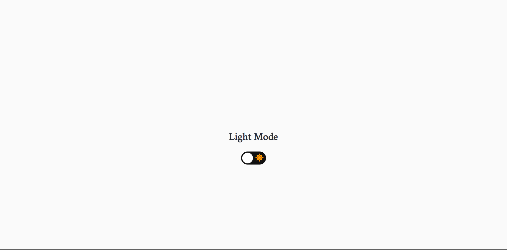
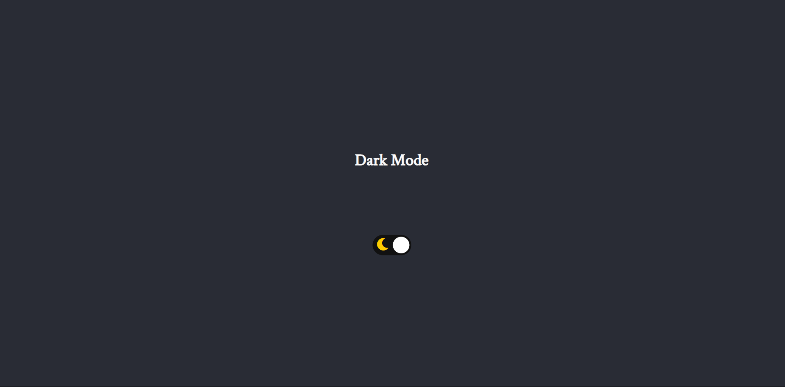
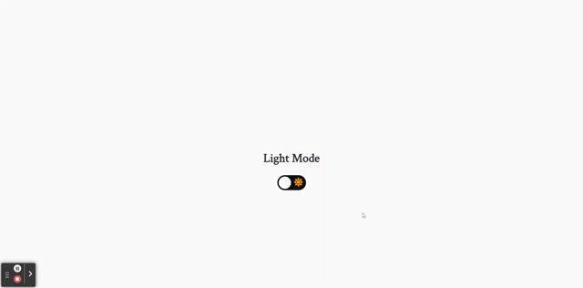

# Light/Dark Mode

Deploy: (EM BREVE)

## Sobre

É uma aplicação para demonstrar o efeito de Claro e Escuro para ser implementado em qualquer projeto.
### Objetivos

Aprender como funciona a função de Claro e Escuro, para que seja usados em projetos futuros. 

### Desafio

Criar mais uma função para projetos usando códigos simples, práticos e funcionais.

### Conclusão

Foi um projeto rápido de realizar, porém muito válido. Agora é mais uma função que irei adicionar nos próximos projetos.

### Ferramentas Utilizadas

- HTML
- CSS
- Javascript
